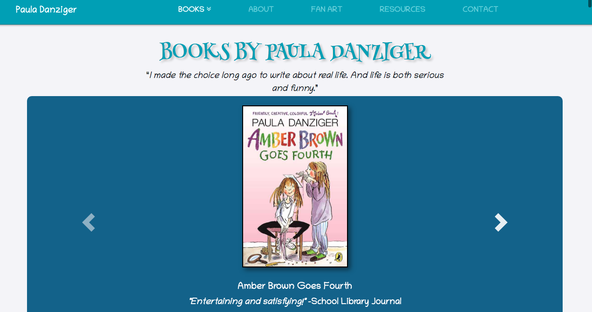
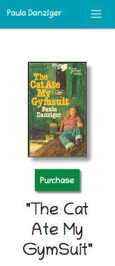

Creating a website for Paula Danziger, showcasing her books and life.

* Bootstrap 4
* Flexbox
* Photoshop
* Progressive Image Enhancement (https://github.com/Wildtyto/Interlace.js)
* JS Captcha (https://codepen.io/darkmeteora/pen/oZbeOJ)
* Hover Text Animations (http://ianlunn.github.io/Hover/)
* SASS
* Jquery
* Smooth Scrolling on Anchor Tags
* Responsive Design
* CSS Animations
* Modal lightbox Image Carousels

